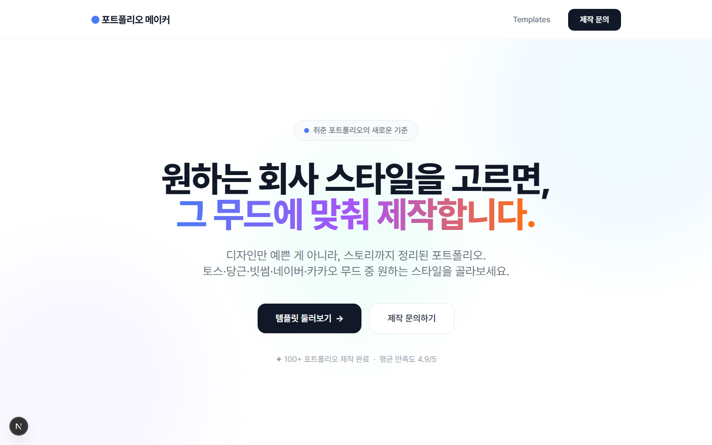
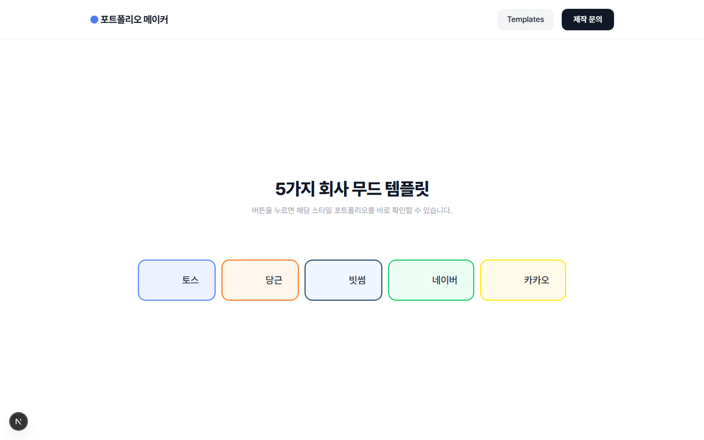

# 포트폴리오 메이커 (Portfolio Maker)

**"원하는 회사 스타일을 고르면, 그 무드에 맞춰 제작합니다."**
토스·당근·빗썸·네이버·카카오 등 잘 알려진 회사의 디자인 무드 중 하나를 골라, 그 스타일 그대로
웹사이트형 포트폴리오를 대신 제작해주는 서비스의 랜딩페이지입니다.

- **Stack**: Next.js 15 (App Router) · React 19 · TypeScript · Tailwind CSS
- **폼 연동**: 제작 문의 → Next.js API Route → Google Apps Script → (Google Sheets 등으로 전달 추정)

## 실제 구동 화면

`npm run dev`로 직접 실행한 뒤 캡처한 실제 화면입니다.


*홈(`/`) — "원하는 회사 스타일을 고르면 그 무드에 맞춰 제작합니다" 히어로 카피, 템플릿 둘러보기/제작 문의 CTA.*


*템플릿 목록(`/templates`) — 토스/당근/빗썸/네이버/카카오 5가지 무드 선택 버튼. 각 버튼이 `/templates/[slug]` 상세 페이지로 연결된다.*

## 템플릿 5종

`lib/template-data.ts`에 단일 소스로 정의되어 있고, 각 템플릿마다 무드 키워드·타겟 유저·강조색이 지정돼 있습니다.

| 템플릿 | 컨셉 | 추천 대상 |
| --- | --- | --- |
| 토스 스타일 | 군더더기 없이 명확한 핀테크 미니멀 | 개발자, 기획자, 데이터 직군 |
| 당근 스타일 | 따뜻하고 친근한 커뮤니티 감성 | PM, 마케터, 커뮤니티 매니저 |
| 빗썸 스타일 | 신뢰감 있는 다크 톤, 금융 전문가 | 금융, 블록체인, 데이터 분석, 퀀트 |
| 네이버 스타일 | 안정감 있는 그린, 대중적 신뢰 | 개발자, UX 디자이너, 서비스 기획 |
| 카카오 스타일 | 밝고 소셜한 라이프스타일 브랜드 | 마케터, 콘텐츠 크리에이터, BX 직군 |

## 페이지 구성

| 경로 | 역할 |
| --- | --- |
| `/` | 홈 — 히어로, 문제 제기, 신뢰 섹션, 템플릿 미리보기 그리드 |
| `/templates` | 템플릿 5종 목록 |
| `/templates/[slug]` | 템플릿 상세 미리보기 (`public/previews/*.html`을 iframe 등으로 노출) |
| `/request` | 제작 신청 폼 |

## 제작 문의 흐름

```
RequestForm (이름, 이메일, 희망 템플릿, 직군, 메시지)
  → POST /api/contact
  → 필수값(이름/이메일/템플릿) 검증
  → GOOGLE_SCRIPT_URL (Google Apps Script)로 전달
```

## 환경 변수

`.env.local`에 아래 값이 필요합니다.

```env
GOOGLE_SCRIPT_URL=https://script.google.com/macros/s/xxx/exec
```

## 실행

```bash
npm install
npm run dev      # http://localhost:3000
npm run build
npm run type-check
```

## 디렉터리 구조

```
app/
  page.tsx                     # 홈
  templates/page.tsx            # 템플릿 목록
  templates/[slug]/page.tsx      # 템플릿 상세
  request/page.tsx               # 제작 신청 폼 페이지
  api/contact/route.ts            # 신청 폼 → Google Apps Script 프록시
components/
  home/                         # Hero, PainPoint, Trust, TemplatePreviewGrid 등 홈 섹션
  templates/                    # TemplateCard, TemplateHero, TemplatePreview, LogoButtons
  request/RequestForm.tsx        # 신청 폼
  layout/Header.tsx, Footer.tsx
lib/
  site-config.ts                # 사이트 전역 설정(이름, 태그라인, 연락처, 내비게이션)
  template-data.ts               # 템플릿 5종 메타데이터 (단일 소스)
public/
  logos/                        # 5개 브랜드 로고
  previews/*.html                # 템플릿별 정적 미리보기 HTML
```
